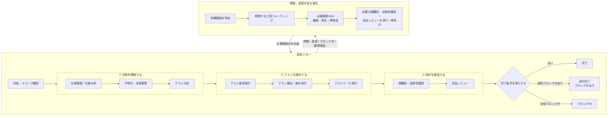

# QAテスト分析・設計・E2Eワークフロー Agent Skills

新規機能・変更機能・指定対象機能を分析し、**テスト実施者が迷わず実行できる詳細テストケースまで落とし込む**ためのAgent Skills群です。要求された場合は、確認済みのPlaywright E2E対象を実装し、指定されたテスト環境へローカル実行し、結果分析・報告まで成果物ベースで扱います。

## Skill構成

```text
skills/
├── qa-workflow/
├── spec-analysis/
├── question-analysis/
├── test-analysis/
├── test-requirement-design/
├── test-condition-design/
├── test-case-design/
├── coverage-analysis/
├── adversarial-review/
├── e2e-test-inspection/
├── e2e-test-implementation/
├── e2e-test-execution/
├── e2e-test-result-analysis/
└── e2e-test-reporting/
```

各Skillは`skills/<skill-name>/SKILL.md`を持つ独立Skillです。`qa-workflow`も1 Skillとして扱います。

| Skill | 責務 |
| --- | --- |
| `qa-workflow` | 開始点、再利用、ルーティング、ブロック中、再開、変更伝播、完了 |
| `spec-analysis` | 仕様分類 / 現在有効な仕様根拠 |
| `question-analysis` | 未解決事項分類 / 仮定 / 回答正規化 |
| `test-analysis` | プロダクトリスク / 重点 / 深度 |
| `test-requirement-design` | テスト要求としての検証責務 |
| `test-condition-design` | テスト条件 / カバレッジ基準 / カバレッジ項目 |
| `test-case-design` | 詳細テストケース / 期待結果の根拠の具体化 |
| `coverage-analysis` | カバレッジ / 閉鎖性 / ギャップ |
| `adversarial-review` | 独立レビュー / 重大度 |
| `e2e-test-inspection` | E2E対象、repo / 実対象の事実、実装可能性、安全条件 |
| `e2e-test-implementation` | 確認済み対象のPlaywright E2E実装と静的 / 軽量検証 |
| `e2e-test-execution` | 実行安全確認、準備、Playwright実行、構造化結果、cleanup |
| `e2e-test-result-analysis` | 実行事実の原因分析、追加証拠、修正routing |
| `e2e-test-reporting` | 検証済み実行・分析結果の人間向け報告 |

## テスト分析・設計フロー

以下は、このSkill群が扱う全体ワークフローの代表経路です。実際には要求成果物と有効な既存成果物に応じて開始工程を決め、途中工程からの開始、既存成果物の再利用、不要工程の省略を行います。

基本フローを主経路とし、ブロック中、修正ルーティング、上流変更による`要再検証`は下段の制御フローへ分離しています。不明点・矛盾はどの工程からでも`question-analysis`へルーティングでき、解消後は影響する再開先工程へ戻ります。



修正が必要な場合は最も早い責任工程へ、ブロック解除後は回答に応じた再開先工程へルーティングします。上流変更時は影響する範囲だけを担当工程へ戻します。

### E2E要求時の条件分岐

全14 Skillを常に通すわけではありません。要求成果物と有効な既存成果物に応じ、必要な依存だけを実行します。

```text
詳細TC / 明示E2E対象 / 既存E2E参照
  ↓（inspection相当情報がなければ）
e2e-test-inspection
  ↓
e2e-test-implementation
  ↓
adversarial-review（対象: E2E実装）
  ↓ 必要時
coverage-analysis（対象: TC → E2E実装）
  ↓
e2e-test-execution
  ├─ 正常かつ分析不要 → 必要なら e2e-test-reporting
  └─ 異常 / 未実行 / cleanup問題 / 分析要求 → e2e-test-result-analysis
                                      ↓ 必要ならexecutionへrouting
                                      ↓ 必要ならe2e-test-reporting
```

既存E2Eの実行だけなら`e2e-test-execution`から開始できます。TCなしの明示E2E対象・既存E2E更新では、対象選定自体が要求されない限り`test-analysis`を必須にせず、TC作成のためだけに`test-case-design`へ戻しません。`qa-workflow`はオーケストレーションだけを担当し、Playwright固有の実装・実行・原因分析・報告再解釈は各E2E Skillへ閉じます。

この拡張はSkillの責務・成果物・評価契約を対象とし、対象プロダクトのCIへE2E実行基盤を新設するものではありません。browser projectや実行方式は対象repoの既存入口を確認して扱い、特定のブラウザ操作方式を共通契約として固定しません。

ワークフロー完了と全E2EテストPASSは別です。FAILでも、要求された実行・分析・報告、cleanup確認、必要な再検証が完了し、未処理のブロッカーがなければワークフローは完了できます。

全体ワークフローは、要求成果物が必要な品質条件を満たし、必要なカバレッジ分析 / 反証レビューが完了し、対象スコープ内にブロック中・`要再検証`・利用停止が必要な未処置指摘が残っていないときに完了します。詳細な完了条件、修正ルーティング、再開先の判断は`qa-workflow`を正本とします。

### 各工程の役割

`qa-workflow`は独立した前後工程ではなく、開始工程の決定から既存成果物の再利用、ブロック中・再開・ルーティング・変更伝播・`要再検証`・修正ルーティング・完了判定までワークフロー全体を横断して管理します。

| # | 工程 | 実際にやること | 主な成果物 | 対応Skill |
| --- | --- | --- | --- | --- |
| 1 | 対象・スコープ確認 | 対象とする機能・挙動・範囲を確認し、要求成果物と利用可能な既存成果物から必要な開始工程を決める | 対象範囲の確認結果、開始 / 再開先、ワークフロー状態 | `qa-workflow` |
| 2 | 仕様整理・仕様分析 | Figma、要件書、Q&A、リポジトリ、リリース資料などを確認し、現在有効な仕様と根拠を整理する | 現在有効な仕様根拠、仕様分析 | `spec-analysis` |
| 3 | 不明点・矛盾整理 | 仕様やQA成果物の不足・矛盾・曖昧さを整理し、ブロック中範囲、継続可否、回答後の再開先を決める | ブロッカー、要確認、仮定可能事項、再開先 | `question-analysis` |
| 4 | テスト分析 | 変更影響とプロダクトリスクを分析し、何をなぜどの深さでテストするかを決める | プロダクトリスク、テスト重点、テストレベル、観測方法 | `test-analysis` |
| 5 | テスト要求設計 | 現在有効な仕様根拠とプロダクトリスクから、何を検証・保証すべきかを定義する | テスト要求 | `test-requirement-design` |
| 6 | テスト観点・条件設計 | テスト要求を、どの条件・観点・組合せで検証するかへ展開する | テスト条件、カバレッジ基準、カバレッジ項目 | `test-condition-design` |
| 7 | テストケース設計 | 第三者が単独で実施し、PASS / FAILを判断できる具体的な前提条件・手順・期待結果へ落とし込む | 詳細テストケース | `test-case-design` |
| 8 | 網羅性・追跡性確認 | 仕様根拠からテストケースまでの意味上のつながり、カバレッジ基準充足、未カバー・重複・根拠不足を確認する | カバレッジ分析、ギャップ、残存リスク | `coverage-analysis` |
| 9 | 反証レビュー | 成果物を独立レビューし、誤り・抜け・過剰・根拠不足・追跡性欠陥を重大度付きで検出する | 反証レビュー結果 | `adversarial-review` |
| 10 | 修正ルーティング・完了判断 | 指摘を最も早い責任工程へルーティングし、影響範囲だけが担当Skillで修正・再検証されるよう制御し、ブロック中 / 要再検証を含むワークフロー全体状態を判定する | 完了 / 部分完了（ブロック中あり） / ブロック中 | `qa-workflow` |

## 成果物チェーン

```text
現在有効な仕様根拠
  ↓
テスト要求
  ↓
テスト条件
  ↓
カバレッジ項目
  ↓
テストケース
  ↓
カバレッジ分析
```

プロダクトリスクは深度・優先度の横断入力です。

## 工程固有ロジックの正本

工程固有ルールは担当Skillを正本とし、`qa-workflow`やレビューSkillへ詳細アルゴリズムを複製しません。

| 工程固有ロジック | 正本 |
| --- | --- |
| 現在有効な仕様根拠 / SPEC・DECISION・ASM | `spec-analysis` |
| 不明点 / 仮定 | `question-analysis` |
| プロダクトリスク | `test-analysis` |
| テスト要求 | `test-requirement-design` |
| カバレッジ基準 / カバレッジ項目 / テスト技法 | `test-condition-design` |
| 詳細テストケース / 期待結果の根拠 | `test-case-design` |
| カバレッジ / ギャップ | `coverage-analysis` |
| 独立レビュー / 重大度 | `adversarial-review` |
| ルーティング / ブロック中 / 再開 / ワークフロー完了 | `qa-workflow` |

## 段階的開示

- `SKILL.md`: 常に必要な契約
- `references/`: 条件付き / 詳細判断
- `assets/`: 出力テンプレート / リソース

## Agent Skills仕様と独自拡張

Agent Skills仕様ベース:

```text
skills/<skill-name>/
├── SKILL.md
├── references/
├── assets/
└── scripts/      # 必要な場合
```

このリポジトリ独自の開発・評価拡張:

```text
EVALS.md

skills/<skill-name>/evals/
├── trigger/
├── output/
├── deterministic/
│   └── validator.py
└── semantic/
    ├── rubric.json
    ├── evals.json
    └── cases/
        ├── case-001/
        │   ├── input.md
        │   └── reference.md
        └── case-002/
            ├── input.md
            └── reference.md

scripts/skills/evals/
├── deterministic/
│   ├── run.py
│   ├── loader.py
│   ├── markdown_parser.py
│   ├── common.py
│   ├── result.py
│   └── tests/
└── semantic/
    ├── run.py
    ├── loader.py
    ├── prompt_builder.py
    ├── result.py
    ├── validate.py
    └── tests/

tests/skills/evals/
├── deterministic/
└── semantic/
```

Skill固有の発火評価データセット、出力フィクスチャ、決定論的validator、意味評価ルーブリック / フィクスチャは各Skillの`evals/`配下に置きます。

`scripts/skills/evals/deterministic/tests/`と`scripts/skills/evals/semantic/tests/`は共通ランタイム固有の移植可能な自己テストを保持します。`tests/skills/evals/`はこのリポジトリ固有のSkill構造、評価データセット、validator契約、CLI、移植性を検証します。

Skillを利用するだけの場合は`skills/<skill-name>/`のみをコピーします。評価も含めてSkillを移植する場合は、`skills/<skill-name>/`（Skill Package）と`scripts/skills/evals/`（共通Skill評価ランタイム）をコピーします。`scripts/skills/evals/`はAgent Skills Specificationが要求する標準ディレクトリではなく、このリポジトリ独自の評価ランタイムです。

`evals/`や評価プログラムはAgent Skills Specificationの必須標準機能ではありません。

## 評価

### 発火評価

14 Skillの選択精度を評価します。正規モードは14 Skill同時利用、単独・限定Skillは診断モードです。train / validationは各Skill12 / 8件、positive / negative比率を維持し、合計280 queryです。repo内データセット検証と実Agentクライアント上の実発火評価は別物です。

### 決定論的出力評価

14 Skillの正規出力について、ID、参照整合、必須フィールド、リスクマトリクス、成果物閉鎖、Pairwise、レビュー / ワークフロー、E2Eの対象・raw fact・primary / attempt・cleanup不変条件など、意味解釈なしで判定できる契約を評価します。

- `known_*`: フィクスチャ側で既知の参照集合。Skill自身が出力内で生成するEntityの扱いは各Skill契約に従う。キー未指定なら対応する参照検査を行わない。
- `required_*`: 出力に実際に存在しなければならないEntity / 値。

```bash
python scripts/skills/evals/deterministic/run.py \
  --skill test-case-design \
  --eval-id TC-OUT-001 \
  --output path/to/generated-output.md
```

### 意味評価

決定論的評価では確定できない意味的正しさ、妥当性、十分性、適切な抽象度、根拠整合、明瞭性を、Skill固有のルーブリックと意味評価フィクスチャに基づくLLM Judgeで評価します。Judgeは評価基準ごとの`rating`と根拠だけを返し、各評価基準の`status`と全体判定は共通ランタイムが算出します。

```bash
python scripts/skills/evals/semantic/run.py \
  --skill test-case-design \
  --eval-id TC-SEM-001 \
  --output path/to/generated-output.md \
  --judge-command python path/to/judge_adapter.py
```

Agent実行と評価対象出力の生成は決定論的 / 意味評価ランタイムの責務外です。詳細な評価契約、評価データセット、CLI、Judge契約、決定論的評価 / 意味評価の境界は`EVALS.md`を正本とします。

## qa-workflowのランタイム前提

同一のAgentクライアント上で14 Skillすべてが利用可能で、Agentが必要なSkillを追加で読み込み / 利用できる環境を前提とします。Agent Skills Specificationが共通Skill-to-Skill APIを保証するとは扱いません。

## 検証

CIで、公式`skills-ref validate`、発火評価データセット構造、決定論的出力評価、意味評価を分離して検証します。外部LLM APIはCIから呼ばず、意味評価Judgeの実行契約はテスト用Judgeで検証します。

## 標準との関係

ISTQB、IVEC、ISO/IEC/IEEE 29119等は、このワークフローの目的に必要な考え方だけをテーラリングして利用し、完全準拠やテストプロセス全体の再現は目的としません。
