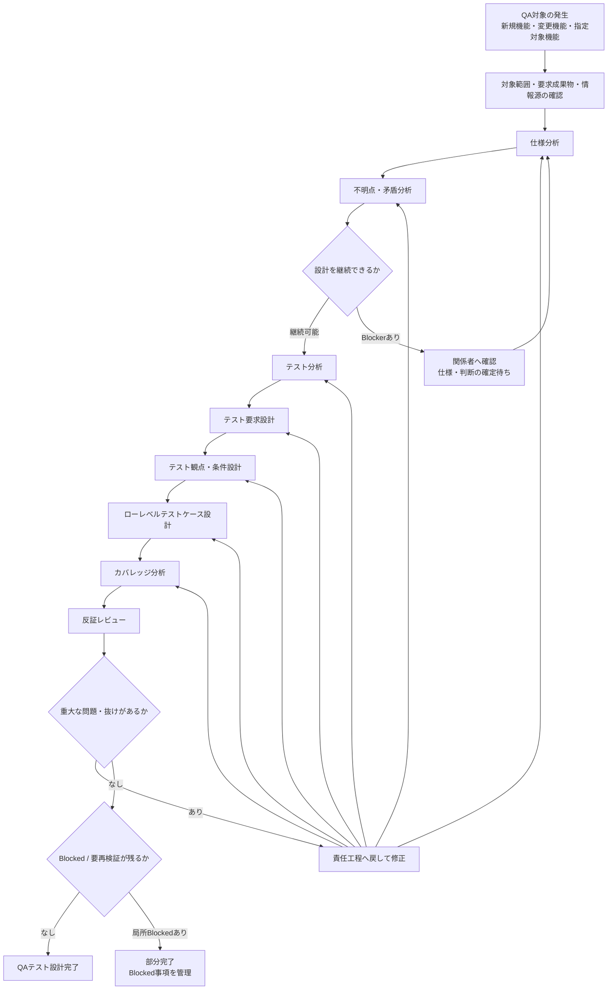

# QAテスト分析・設計 Agent Skills

新規機能・変更機能・指定対象機能を分析し、**テスト実施者が迷わず実行できるLow-Level Test Caseまで落とし込む**ためのAgent Skills群です。

## Skill構成

```text
skills/
├── qa-workflow/
├── spec-analysis/
├── question-analysis/
├── test-analysis/
├── test-requirement-design/
├── test-condition-design/
├── test-case-design/
├── coverage-analysis/
└── adversarial-review/
```

各Skillは`skills/<skill-name>/SKILL.md`を持つ独立Skillです。`qa-workflow`も1 Skillとして扱います。

| Skill | 責務 |
| --- | --- |
| `qa-workflow` | 開始点、再利用、routing、Blocked、再開、変更伝播、完了 |
| `spec-analysis` | 仕様分類 / Current Effective Authority |
| `question-analysis` | 未解決事項分類 / Assumption / 回答正規化 |
| `test-analysis` | Product Risk / 重点 / 深度 |
| `test-requirement-design` | 検証責務 |
| `test-condition-design` | Test Condition / Coverage Criteria / Item |
| `test-case-design` | Low-Level Test Case / Oracle具体化 |
| `coverage-analysis` | Coverage / 閉鎖性 / Gap |
| `adversarial-review` | Cold Review / 重大度 |

## 現行QA業務フロー（テスト分析・設計）

本リポジトリのSkill群が担う、QA対象の発生からテスト設計完了までの基本業務フローです。単純な直列処理ではなく、不明点による局所Blocked、責任工程への修正routing、上流変更時の影響範囲だけの再検証を含みます。



## 成果物チェーン

```text
Current Effective Authority
  ↓
Test Requirement
  ↓
Test Condition
  ↓
Coverage Item
  ↓
Test Case
  ↓
Coverage Analysis
```

Product Riskは深度・優先度の横断入力です。

## Domain LogicのSingle Source of Truth

工程固有ルールは担当Skillを正本とし、`qa-workflow`やreview Skillへ詳細アルゴリズムを複製しません。

| Domain Logic | Single Source of Truth |
| --- | --- |
| Current Effective Authority / SPEC・DECISION・ASM | `spec-analysis` |
| 不明点 / Assumption | `question-analysis` |
| Product Risk | `test-analysis` |
| Test Requirement | `test-requirement-design` |
| Coverage Criteria / Item / テスト技法 | `test-condition-design` |
| Low-Level Test Case / Oracle | `test-case-design` |
| Coverage / Gap | `coverage-analysis` |
| Cold Review / 重大度 | `adversarial-review` |
| routing / Blocked / 再開 / Workflow完了 | `qa-workflow` |

## Progressive Disclosure

- `SKILL.md`: 常に必要な契約
- `references/`: 条件付き / 詳細判断
- `assets/`: 出力template / resource

## Agent Skills仕様と独自拡張

Agent Skills仕様ベース:

```text
skills/<skill-name>/
├── SKILL.md
├── references/
├── assets/
└── scripts/      # 必要な場合
```

このリポジトリ独自の開発・評価拡張:

```text
EVALS.md

skills/<skill-name>/evals/
├── trigger/
├── output/
├── deterministic/
│   └── validator.py
└── semantic/
    ├── rubric.json
    ├── evals.json
    └── cases/
        ├── case-001/
        │   ├── input.md
        │   └── reference.md
        └── case-002/
            ├── input.md
            └── reference.md

scripts/skills/evals/
├── deterministic/
│   ├── run.py
│   ├── loader.py
│   ├── markdown_parser.py
│   ├── common.py
│   ├── result.py
│   └── tests/
└── semantic/
    ├── run.py
    ├── loader.py
    ├── prompt_builder.py
    ├── result.py
    ├── validate.py
    └── tests/

tests/skills/evals/
├── deterministic/
└── semantic/
```

Skill固有のTrigger dataset、Output fixture、Deterministic validator、Semantic rubric / fixtureは各Skillの`evals/`配下に置きます。

`scripts/skills/evals/deterministic/tests/`と`scripts/skills/evals/semantic/tests/`はShared Runtime固有のportable self-testを保持します。`tests/skills/evals/`はこのリポジトリ固有のSkill構造、dataset、validator contract、CLI、portabilityを検証します。

Skillを利用するだけの場合は`skills/<skill-name>/`のみをコピーします。Evalも含めてSkillを移植する場合は、`skills/<skill-name>/`（Skill Package）と`scripts/skills/evals/`（Shared Skill Eval Runtime）をコピーします。`scripts/skills/evals/`はAgent Skills Specificationが要求する標準ディレクトリではなく、このリポジトリ独自の評価Runtimeです。

`evals/`やgraderはAgent Skills Specificationの必須標準機能ではありません。

## Eval

### Trigger Eval

9 Skillの選択精度を評価します。Canonical Modeは9 Skill同時利用、単独・限定SkillはDiagnostic Modeです。

### Deterministic Output Eval

9 SkillのCanonical outputについて、ID、参照整合、required fields、Risk Matrix、成果物閉鎖、Pairwise、review / Workflow invariant等、意味解釈なしで判定できる契約を評価します。

- `known_*`: fixture側で既知の参照集合。Skill自身がOutput内で生成するEntityの扱いは各Skill契約に従う。キー未指定なら対応する参照検査を行わない。
- `required_*`: Outputに実際に存在しなければならないEntity / 値。

```bash
python scripts/skills/evals/deterministic/run.py \
  --skill test-case-design \
  --eval-id TC-OUT-001 \
  --output path/to/generated-output.md
```

### Semantic Output Eval

Deterministicでは確定できない意味的正しさ、妥当性、十分性、適切な抽象度、根拠整合、明瞭性を、Skill固有rubricとSemantic fixtureに基づくLLM Judgeで評価します。Judgeはcriterionごとのratingと根拠だけを返し、criterion statusとoverall verdictはShared Runtimeが算出します。

```bash
python scripts/skills/evals/semantic/run.py \
  --skill test-case-design \
  --eval-id TC-SEM-001 \
  --output path/to/generated-output.md \
  --judge-command python path/to/judge_adapter.py
```

Agent実行とCandidate Output生成はDeterministic / Semantic Runtimeの責務外です。詳細な評価契約、dataset、CLI、Judge contract、Deterministic / Semantic境界は`EVALS.md`を正本とします。

## qa-workflow Runtime前提

同一Agent client上で9 Skillすべてが利用可能で、Agentが必要なSkillを追加ロード / 利用できる環境を前提とします。Agent Skills Specificationが共通Skill-to-Skill APIを保証するとは扱いません。

## Validation

CIで、公式`skills-ref validate`、Trigger dataset構造、Deterministic Output Eval、Semantic Output Evalを分離して検証します。外部LLM APIはCIから呼ばず、Semantic judge execution contractはfake judgeで検証します。

## 標準との関係

ISTQB、IVEC、ISO/IEC/IEEE 29119等は、このWorkflowの目的に必要な考え方だけをテーラリングして利用し、完全準拠やテストプロセス全体の再現は目的としません。
